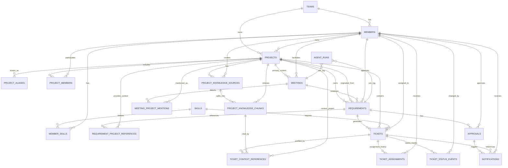

# Database Dictionary — AI Meeting-to-Tickets PM v3

Modelo ajustado para los nuevos casos de uso:

- El agente debe tener una **base de conocimiento por proyecto**.
- Una reunión puede tener un **proyecto principal**, pero mencionar requerimientos relacionados con **otros proyectos**.
- El sistema debe guardar evidencia y referencias para que el agente cree tickets usando información real, no suposiciones.

---

## ER Diagram



---

## Conceptual Flow

```text
Project knowledge is loaded first
  → project aliases help resolve vague mentions
  → meeting has a primary project
  → meeting_project_mentions records other projects mentioned
  → requirements can belong to the correct project, not necessarily the meeting's primary project
  → requirement_project_references links cross-project context
  → tickets cite ticket_context_references, proving which knowledge was used
```

---

## 1. `teams`

Workspace/tenant root.

| Column | Type | Constraints | Purpose |
|---|---|---|---|
| `id` | `uuid` | PK, default `gen_random_uuid()` | Team ID |
| `name` | `text` | not null | Team display name |
| `slug` | `text` | not null, unique | Stable tenant key, e.g. `demo` |
| `created_at` | `timestamptz` | default `now()` | Created timestamp |

---

## 2. `skills`

Normalized skill catalog.

| Column | Type | Constraints | Purpose |
|---|---|---|---|
| `id` | `uuid` | PK | Skill ID |
| `code` | `text` | not null, unique | `frontend`, `backend`, `data`, `qa`, `devops` |
| `label` | `text` | not null | Human readable label |

---

## 3. `members`

People available for assignments or approvals.

| Column | Type | Constraints | Purpose |
|---|---|---|---|
| `id` | `uuid` | PK | Member ID |
| `team_id` | `uuid` | FK → `teams.id`, not null | Owning team |
| `name` | `text` | not null | Name |
| `email` | `text` | unique with `team_id` | Notification email |
| `role` | `text` | nullable | Job title |
| `current_load` | `int` | default `0`, check `0-100` | Current workload |
| `is_manager` | `boolean` | default `false` | Can approve plans |
| `created_at` | `timestamptz` | default `now()` | Created timestamp |

---

## 4. `member_skills`

Many-to-many between members and skills.

| Column | Type | Constraints | Purpose |
|---|---|---|---|
| `member_id` | `uuid` | PK, FK → `members.id` | Member |
| `skill_id` | `uuid` | PK, FK → `skills.id` | Skill |
| `proficiency` | `smallint` | default `3`, check `1-5` | Skill level |

---

## 5. `projects`

Main business/product context. A meeting may start in one project, but the extracted requirement may point to another.

| Column | Type | Constraints | Purpose |
|---|---|---|---|
| `id` | `uuid` | PK | Project ID |
| `team_id` | `uuid` | FK → `teams.id`, not null | Owning team |
| `code` | `text` | unique with `team_id` | Short code, e.g. `ERP-FIN` |
| `name` | `text` | not null | Project name |
| `description` | `text` | nullable | Description |
| `business_area` | `text` | nullable | Area such as `finanzas`, `ventas` |
| `status` | `text` | default `active`, check enum | `active`, `on_hold`, `completed`, `archived` |
| `owner_id` | `uuid` | FK → `members.id`, set null | Project owner |
| `started_at` | `date` | nullable | Start date |
| `target_date` | `date` | nullable | Target date |
| `created_at` | `timestamptz` | default `now()` | Created timestamp |

---

## 6. `project_aliases`

Names or phrases used in meetings to refer to a project. This is key for vague references.

| Column | Type | Constraints | Purpose |
|---|---|---|---|
| `id` | `uuid` | PK | Alias ID |
| `project_id` | `uuid` | FK → `projects.id`, not null | Resolved project |
| `alias` | `text` | not null | Phrase as users say it |
| `normalized_alias` | `text` | not null, unique with `project_id` | Matching-friendly value |
| `created_at` | `timestamptz` | default `now()` | Created timestamp |

Example: `CRM Ventas`, `pipeline comercial`, `clientes y oportunidades` can all point to the same project.

---

## 7. `project_members`

Project staffing.

| Column | Type | Constraints | Purpose |
|---|---|---|---|
| `project_id` | `uuid` | PK, FK → `projects.id` | Project |
| `member_id` | `uuid` | PK, FK → `members.id` | Member |
| `role` | `text` | default `contributor`, check enum | `owner`, `contributor`, `stakeholder` |
| `joined_at` | `timestamptz` | default `now()` | Joined timestamp |

---

## 8. `project_knowledge_sources`

Source documents or notes that form the project's knowledge base.

| Column | Type | Constraints | Purpose |
|---|---|---|---|
| `id` | `uuid` | PK | Source ID |
| `project_id` | `uuid` | FK → `projects.id`, not null | Project whose context this belongs to |
| `title` | `text` | not null | Source title |
| `source_type` | `text` | not null, check enum | `manual_note`, `meeting_recap`, `document`, `url`, `ticket_history`, `decision` |
| `source_uri` | `text` | nullable | URL, file path, or external reference |
| `raw_content` | `text` | nullable | Original content |
| `summary` | `text` | nullable | Agent-friendly summary |
| `trust_level` | `text` | default `verified`, check enum | `draft`, `verified`, `deprecated` |
| `metadata` | `jsonb` | nullable | Extra source metadata |
| `created_by_id` | `uuid` | FK → `members.id`, set null | Who added it |
| `created_at` | `timestamptz` | default `now()` | Created timestamp |
| `updated_at` | `timestamptz` | default `now()` | Last update |

---

## 9. `project_knowledge_chunks`

Searchable chunks derived from knowledge sources. Used by the agent for retrieval.

| Column | Type | Constraints | Purpose |
|---|---|---|---|
| `id` | `uuid` | PK | Chunk ID |
| `source_id` | `uuid` | FK → `project_knowledge_sources.id`, not null | Parent source |
| `project_id` | `uuid` | FK → `projects.id`, not null | Denormalized project for filtering |
| `chunk_index` | `int` | default `0`, unique with `source_id` | Chunk order |
| `content` | `text` | not null | Chunk text |
| `embedding` | `vector(1536)` | nullable | Optional semantic search embedding |
| `metadata` | `jsonb` | nullable | Chunk metadata |
| `created_at` | `timestamptz` | default `now()` | Created timestamp |

---

## 10. `meetings`

Input meeting or recap. It always has a primary project context, even if it references others.

| Column | Type | Constraints | Purpose |
|---|---|---|---|
| `id` | `uuid` | PK | Meeting ID |
| `primary_project_id` | `uuid` | FK → `projects.id`, not null | Project being discussed primarily |
| `title` | `text` | nullable | Meeting title |
| `raw_transcript` | `text` | nullable | Transcript/recap |
| `audio_storage_path` | `text` | nullable | Supabase Storage path |
| `audio_duration_sec` | `int` | nullable | Audio duration |
| `source` | `text` | default `upload`, check enum | `upload`, `browser_record`, `paste` |
| `status` | `text` | default `draft`, check enum | `draft`, `transcribed`, `processed` |
| `facilitator_id` | `uuid` | FK → `members.id`, set null | Person who captured it |
| `recorded_at` | `timestamptz` | default `now()` | Meeting timestamp |
| `created_at` | `timestamptz` | default `now()` | Created timestamp |

---

## 11. `meeting_project_mentions`

Detected project references inside a meeting. This supports the case where someone says “eso del pipeline” while talking about ERP.

| Column | Type | Constraints | Purpose |
|---|---|---|---|
| `id` | `uuid` | PK | Mention ID |
| `meeting_id` | `uuid` | FK → `meetings.id`, not null | Source meeting |
| `mentioned_project_id` | `uuid` | FK → `projects.id`, set null | Resolved project, if known |
| `mentioned_text` | `text` | not null | Exact phrase from recap |
| `confidence_pct` | `int` | check `0-100` | Confidence in resolution |
| `resolution_status` | `text` | default `resolved`, check enum | `resolved`, `ambiguous`, `unknown` |
| `resolution_reasoning` | `text` | nullable | Why it matched or why it is ambiguous |
| `created_at` | `timestamptz` | default `now()` | Created timestamp |

---

## 12. `requirements`

Extracted requirement. Its `project_id` is the project where the requirement should live; `origin_project_id` preserves where the meeting started.

| Column | Type | Constraints | Purpose |
|---|---|---|---|
| `id` | `uuid` | PK | Requirement ID |
| `project_id` | `uuid` | FK → `projects.id`, not null | Correct project context for the requirement |
| `meeting_id` | `uuid` | FK → `meetings.id`, set null | Source meeting |
| `origin_project_id` | `uuid` | FK → `projects.id`, set null | Primary meeting project when extracted |
| `title` | `text` | nullable | Requirement title |
| `summary` | `text` | nullable | AI-generated summary |
| `context_confidence_pct` | `int` | check `0-100` | Confidence that correct context was selected |
| `status` | `text` | default `draft`, check enum | `draft`, `extracted`, `approved` |
| `approved_at` | `timestamptz` | nullable | Approval time |
| `approved_by_id` | `uuid` | FK → `members.id`, set null | Approver |
| `created_at` | `timestamptz` | default `now()` | Created timestamp |

---

## 13. `requirement_project_references`

Cross-project context links for a requirement.

| Column | Type | Constraints | Purpose |
|---|---|---|---|
| `id` | `uuid` | PK | Reference ID |
| `requirement_id` | `uuid` | FK → `requirements.id`, not null | Requirement |
| `referenced_project_id` | `uuid` | FK → `projects.id`, not null | Related project |
| `relation_type` | `text` | default `related_context`, check enum | `primary_scope`, `related_context`, `dependency`, `conflict`, `blocked_by` |
| `evidence_text` | `text` | nullable | Phrase that justifies the link |
| `confidence_pct` | `int` | check `0-100` | Link confidence |
| `created_at` | `timestamptz` | default `now()` | Created timestamp |

---

## 14. `tickets`

Operational work items generated from requirements.

| Column | Type | Constraints | Purpose |
|---|---|---|---|
| `id` | `uuid` | PK | Ticket ID |
| `requirement_id` | `uuid` | FK → `requirements.id`, not null | Parent requirement |
| `project_id` | `uuid` | FK → `projects.id`, not null | Project that owns the ticket |
| `title` | `text` | not null | Ticket title |
| `description` | `text` | nullable | Details |
| `priority` | `text` | check enum | `low`, `medium`, `high` |
| `estimate_hours` | `int` | nullable, check `> 0` | Effort estimate |
| `required_skill_id` | `uuid` | FK → `skills.id`, set null | Needed skill |
| `risk_pct` | `int` | default `0`, check `0-100` | Assignment risk |
| `assignee_id` | `uuid` | FK → `members.id`, set null | Current assignee |
| `assignment_reasoning` | `text` | nullable | Why assigned |
| `status` | `text` | default `backlog`, check enum | `backlog`, `todo`, `in_progress`, `done` |
| `deadline` | `date` | nullable | Due date |
| `kanban_order` | `int` | default `0` | Sort order |
| `created_at` | `timestamptz` | default `now()` | Created timestamp |
| `updated_at` | `timestamptz` | default `now()` | Last update |

---

## 15. `ticket_context_references`

Evidence used by the agent when creating a ticket. This is the anti-hallucination table.

| Column | Type | Constraints | Purpose |
|---|---|---|---|
| `id` | `uuid` | PK | Context reference ID |
| `ticket_id` | `uuid` | FK → `tickets.id`, not null | Ticket being justified |
| `knowledge_chunk_id` | `uuid` | FK → `project_knowledge_chunks.id`, set null | Source chunk used |
| `project_id` | `uuid` | FK → `projects.id`, set null | Project that provided the context |
| `evidence_text` | `text` | nullable | Short quote/snippet used by the agent |
| `relevance_pct` | `int` | check `0-100` | How relevant this evidence was |
| `created_at` | `timestamptz` | default `now()` | Created timestamp |

---

## 16. `ticket_assignments`

Assignment history.

| Column | Type | Constraints | Purpose |
|---|---|---|---|
| `id` | `uuid` | PK | Assignment event ID |
| `ticket_id` | `uuid` | FK → `tickets.id`, not null | Ticket |
| `assignee_id` | `uuid` | FK → `members.id`, set null | Assignee |
| `risk_pct` | `int` | check `0-100` | Risk at assignment time |
| `reasoning` | `text` | nullable | Reasoning |
| `source` | `text` | default `agent`, check enum | `agent`, `manager`, `system` |
| `is_current` | `boolean` | default `true` | Current assignment flag |
| `created_at` | `timestamptz` | default `now()` | Created timestamp |

---

## 17. `ticket_status_events`

Kanban movement history.

| Column | Type | Constraints | Purpose |
|---|---|---|---|
| `id` | `uuid` | PK | Event ID |
| `ticket_id` | `uuid` | FK → `tickets.id`, not null | Ticket |
| `from_status` | `text` | nullable | Previous status |
| `to_status` | `text` | not null | New status |
| `changed_by_id` | `uuid` | FK → `members.id`, set null | Who changed it |
| `source` | `text` | default `api`, check enum | `web`, `api`, `agent` |
| `created_at` | `timestamptz` | default `now()` | Created timestamp |

---

## 18. `approvals`

Approval and n8n webhook result.

| Column | Type | Constraints | Purpose |
|---|---|---|---|
| `id` | `uuid` | PK | Approval ID |
| `requirement_id` | `uuid` | FK → `requirements.id`, not null | Approved requirement |
| `approved_by_id` | `uuid` | FK → `members.id`, set null | Approver |
| `n8n_notified` | `boolean` | default `false` | Webhook called |
| `n8n_ok` | `boolean` | nullable | Webhook success |
| `webhook_payload` | `jsonb` | nullable | Payload sent |
| `created_at` | `timestamptz` | default `now()` | Created timestamp |

---

## 19. `notifications`

Notification log.

| Column | Type | Constraints | Purpose |
|---|---|---|---|
| `id` | `uuid` | PK | Notification ID |
| `approval_id` | `uuid` | FK → `approvals.id`, set null | Related approval |
| `ticket_id` | `uuid` | FK → `tickets.id`, set null | Related ticket |
| `member_id` | `uuid` | FK → `members.id`, not null | Recipient |
| `channel` | `text` | default `email`, check enum | `email`, `slack`, `webhook` |
| `template` | `text` | nullable | `assignee_notice`, `manager_summary`, `risk_alert` |
| `status` | `text` | default `pending`, check enum | `pending`, `sent`, `failed` |
| `sent_at` | `timestamptz` | nullable | Sent timestamp |
| `error_message` | `text` | nullable | Failure reason |
| `metadata` | `jsonb` | nullable | Provider response |
| `created_at` | `timestamptz` | default `now()` | Created timestamp |

---

## 20. `agent_runs`

AI observability.

| Column | Type | Constraints | Purpose |
|---|---|---|---|
| `id` | `uuid` | PK | Run ID |
| `agent` | `text` | not null, check enum | `transcribe`, `meeting`, `assignment` |
| `entity_type` | `text` | nullable | `meeting`, `requirement`, `ticket`, etc. |
| `entity_id` | `uuid` | nullable | Entity processed |
| `model` | `text` | nullable | Model name |
| `latency_ms` | `int` | nullable | Runtime |
| `tokens_in` | `int` | nullable | Input tokens |
| `tokens_out` | `int` | nullable | Output tokens |
| `ok` | `boolean` | default `true` | Success flag |
| `error_message` | `text` | nullable | Error detail |
| `created_at` | `timestamptz` | default `now()` | Created timestamp |

---

## Views

## `board_tickets`

Frontend Kanban view.

| Column | Purpose |
|---|---|
| `id` | Ticket ID |
| `requirement_id` | Requirement ID |
| `project_id` | Project ID |
| `project_name` | Project name |
| `title` | Ticket title |
| `description` | Ticket details |
| `priority` | Priority |
| `estimate_hours` | Estimate |
| `required_skill` | Skill code |
| `risk_pct` | Risk |
| `assignee_id` | Assignee ID |
| `assignee_name` | Assignee name |
| `assignment_reasoning` | Tooltip reasoning |
| `status` | Kanban status |
| `deadline` | Due date |
| `kanban_order` | Sort order |
| `created_at` | Created timestamp |
| `updated_at` | Updated timestamp |

## `project_context_map`

Agent/frontend view to understand which projects have usable context.

| Column | Purpose |
|---|---|
| `project_id` | Project ID |
| `project_name` | Project name |
| `project_code` | Project code |
| `business_area` | Business area |
| `aliases` | Known aliases/mentions |
| `knowledge_sources_count` | Number of source docs/notes |
| `knowledge_chunks_count` | Number of searchable chunks |
| `last_knowledge_update` | Last context update |

## `agent_logs`

Compatibility view over `agent_runs`.

---

## Agent Rules Enabled By This Schema

1. If the recap mentions a project name or alias, resolve it through `projects` + `project_aliases`.
2. If a mention is ambiguous, insert `meeting_project_mentions.resolution_status = 'ambiguous'` and do not create final tickets until reviewed.
3. Before creating tickets, retrieve `project_knowledge_chunks` for the selected project.
4. Every ticket created from knowledge must write at least one `ticket_context_references` row.
5. If a requirement belongs to another project, set `requirements.project_id` to that project and `requirements.origin_project_id` to the meeting's `primary_project_id`.
6. If a requirement depends on another project, write `requirement_project_references`.

---

## Setup Order

1. Run `seed/001_schema.sql`.
2. Run `seed/002_seed_demo.sql`.
3. Verify:

```sql
select 'projects' as table_name, count(*) from projects
union all select 'aliases', count(*) from project_aliases
union all select 'knowledge_sources', count(*) from project_knowledge_sources
union all select 'knowledge_chunks', count(*) from project_knowledge_chunks;
```

Expected seed:

| Table | Count |
|---|---:|
| `projects` | 2 |
| `project_aliases` | 6 |
| `project_knowledge_sources` | 2 |
| `project_knowledge_chunks` | 2 |

