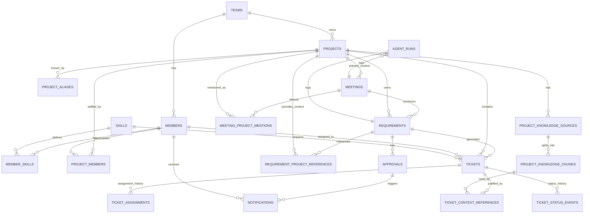

# ER Compacto — AI Meeting-to-Tickets PM

Versión comprimida del modelo ER v3. El detalle completo de atributos está en `docs/DATABASE_DICTIONARY.md`.

---

## Diagrama ER Compacto



---

## Módulos Del Modelo

### 1. Organización Y Equipo

| Tabla | Rol |
|---|---|
| `teams` | Workspace o tenant principal |
| `members` | Personas asignables y aprobadores |
| `skills` | Catálogo de habilidades |
| `member_skills` | Habilidades por persona |

### 2. Proyectos

| Tabla | Rol |
|---|---|
| `projects` | Contenedor principal de trabajo |
| `project_aliases` | Nombres alternos para detectar menciones vagas |
| `project_members` | Personas asociadas al proyecto |

### 3. Base De Conocimiento

| Tabla | Rol |
|---|---|
| `project_knowledge_sources` | Documentos, recaps, notas o decisiones verificadas |
| `project_knowledge_chunks` | Fragmentos buscables por el agente, con embeddings opcionales |

### 4. Reuniones Y Contexto Cruzado

| Tabla | Rol |
|---|---|
| `meetings` | Recap/transcripción con un proyecto principal |
| `meeting_project_mentions` | Otros proyectos mencionados en la reunión |
| `requirements` | Requerimientos extraídos y asignados al proyecto correcto |
| `requirement_project_references` | Relaciones entre requerimientos y otros proyectos |

### 5. Operación Y Kanban

| Tabla | Rol |
|---|---|
| `tickets` | Trabajo accionable generado por IA |
| `ticket_context_references` | Evidencia real usada para justificar tickets |
| `ticket_assignments` | Historial de asignaciones |
| `ticket_status_events` | Historial de movimientos Kanban |

### 6. Aprobación, Notificación Y Observabilidad

| Tabla | Rol |
|---|---|
| `approvals` | Aprobación del plan por manager |
| `notifications` | Emails/webhooks enviados por n8n |
| `agent_runs` | Logs de agentes, latencia, modelo y errores |

---

## Flujo Clave

```text
Proyecto principal de la reunión
  → aliases detectan menciones vagas a otros proyectos
  → knowledge base aporta contexto real
  → requirement se guarda en el proyecto correcto
  → tickets se generan con evidencia citada
  → asignación, Kanban, aprobación y notificaciones
```

---

## Regla Anti-Alucinación

Todo ticket generado por el agente debería tener al menos una fila en `ticket_context_references`, apuntando a un `project_knowledge_chunk` o registrando `evidence_text`.

