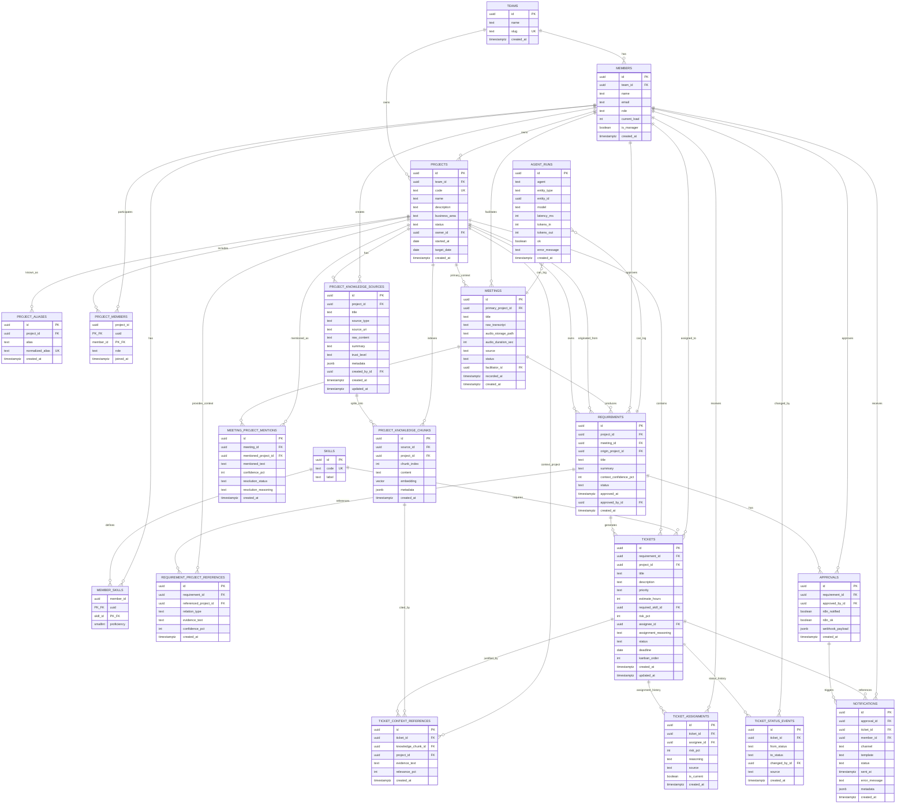

# ER Completo — AI Meeting-to-Tickets PM

Diagrama ER completo del esquema v3, incluyendo relaciones y atributos de cada tabla.

---

## ER Diagram Completo

---

## Notas De Lectura

- `meetings.primary_project_id` representa el proyecto principal de la reunión.
- `meeting_project_mentions` guarda otros proyectos mencionados en la reunión.
- `requirements.project_id` representa el proyecto correcto al que pertenece el requerimiento.
- `requirements.origin_project_id` conserva desde qué proyecto/reunión surgió la mención.
- `project_knowledge_sources` y `project_knowledge_chunks` son la base de conocimiento que el agente debe consultar.
- `ticket_context_references` guarda la evidencia usada por el agente para crear cada ticket.

