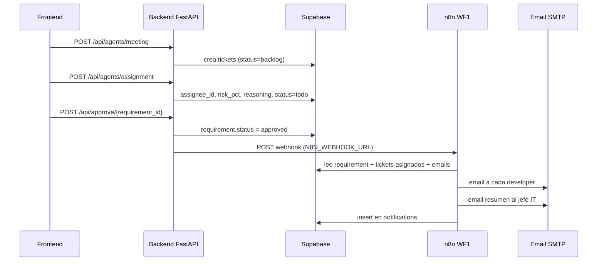

# Guía de integración n8n — Meeting → Tickets PM

Esta guía explica cómo funciona n8n en el proyecto, cuál es el trigger de cada workflow y cómo configurar el envío de correos.

---

## Rol de n8n en la arquitectura

**n8n no asigna tickets.** Eso lo hace el backend FastAPI con el Assignment Agent (OpenAI + Supabase).

n8n entra **después** de la asignación, cuando el manager aprueba el plan, para:

- Consultar Supabase y leer las asignaciones ya guardadas
- Enviar correos a cada developer asignado
- Enviar un resumen al jefe de IT con el razonamiento
- Registrar auditoría en la tabla `notifications`

---

## Flujo completo (WF1 — Aprobación)



### Orden obligatorio

1. **Meeting Agent** (`POST /api/agents/meeting`) → crea tickets en Supabase
2. **Assignment Agent** (`POST /api/agents/assignment`) → asigna developers, riesgo y reasoning
3. **Approve** (`POST /api/approve/{requirement_id}`) → dispara n8n

Si apruebas **sin** ejecutar assignment antes, WF1 fallará porque no hay tickets con `assignee_id`.

---

## Triggers por workflow

| Workflow | Archivo | Trigger | Cuándo corre |
|---|---|---|---|
| **WF1** | `01-aprobacion.json` | **Webhook POST** `/webhook/plan-aprobado` | Cuando el backend aprueba un requirement |
| **WF2** | `02-deadlines-vencidas.json` | Cron `0 8 * * *` | Diario 8:00 am |
| **WF3** | `03-tickets-estancados.json` | Cron `0 9 * * *` | Diario 9:00 am |
| **WF4** | `04-digest-semanal.json` | Cron `0 7 * * 1` | Lunes 7:00 am |

WF2–WF4 son automáticos por cron. Solo necesitan estar **activos** en n8n.

---

## WF1 — Trigger y conexión con el backend

### Trigger

- **Tipo:** Webhook HTTP
- **Método:** `POST`
- **Path:** `plan-aprobado`
- **Respuesta:** inmediata (`onReceived`), el procesamiento continúa en background

URL de producción (ejemplo):

```text
https://TU-INSTANCIA.n8n.cloud/webhook/plan-aprobado
```

### Configuración en el backend

En `backend/.env`:

```env
N8N_WEBHOOK_URL=https://TU-INSTANCIA.n8n.cloud/webhook/plan-aprobado
```

El backend llama este webhook desde `POST /api/approve/{requirement_id}` vía `services.notify_n8n()`.

### Payload que envía el backend hoy

```json
{
  "requirement": {
    "id": "uuid-del-requirement",
    "project_id": "uuid-del-proyecto",
    "meeting_id": "uuid-de-la-reunion",
    "status": "approved"
  },
  "tickets": [
    {
      "id": "uuid-ticket",
      "assignee_id": "uuid-member",
      "risk_pct": 65,
      "status": "todo"
    }
  ]
}
```

WF1 extrae `requirement.id`, consulta Supabase de nuevo (emails, skills, reasoning) y arma los correos con datos actualizados.

---

## Qué hace WF1 por dentro

1. **Webhook Backend Approval** — recibe el POST del backend
2. **Normalizar Payload Backend** — obtiene `requirement_id`
3. **Consultar Requirement** — proyecto, reunión, contexto
4. **Consultar Tickets Asignados** — tickets con `assignee_id`, `members.email`, `assignment_reasoning`
5. **Consultar Managers** — jefe IT (`is_manager = true` o owner del proyecto)
6. **Construir Correos desde Supabase** — un item por ticket asignado
7. **Email Developer Asignado** — correo a `members.email`
8. **Log Email Developer** — insert en `notifications`
9. **Email Resumen Jefe IT** — tabla con todas las asignaciones y el “por qué”
10. **Log Email Jefe IT** — insert en `notifications`

### Tablas que WF1 consulta

- `requirements` (+ `projects`, `meetings`)
- `tickets` del requirement con joins a `members` y `skills`
- `ticket_assignments` (reasoning persistido por el backend)
- `members` con `is_manager = true`

### Tablas que WF1 escribe

- `notifications` solamente

La escritura de `tickets`, `ticket_assignments` y `ticket_status_events` ocurre en el backend durante `/api/agents/assignment`.

---

## Cómo configurar el envío de correos

Hay **3 piezas**: credencial SMTP en n8n, variables de entorno en n8n, y emails en Supabase.

### 1. Credencial SMTP en n8n (obligatorio)

**Settings → Credentials → Add credential → SMTP**

Nombre recomendado: **`SMTP`** (los JSONs ya lo referencian).

#### Con Gmail (rápido para demo)

| Campo | Valor |
|---|---|
| Host | `smtp.gmail.com` |
| Port | `587` |
| User | tu Gmail |
| Password | App Password (no tu contraseña normal) |
| Secure | STARTTLS |

Pasos:

1. Activar 2FA en la cuenta Google
2. Ir a [App Passwords](https://myaccount.google.com/apppasswords)
3. Generar contraseña de aplicación (16 caracteres)
4. Pegarla en la credencial SMTP de n8n

Después de importar el workflow, abrir cada nodo **Send Email** y seleccionar la credencial `SMTP`.

### 2. Variables de entorno en n8n

**Settings → Variables:**

| Variable | Descripción | Ejemplo |
|---|---|---|
| `SUPABASE_URL` | URL del proyecto Supabase | `https://xxx.supabase.co` |
| `SUPABASE_SERVICE_KEY` | `service_role` key | `eyJhbGci...` |
| `SMTP_FROM` | Remitente (`From:`) | `pm@tuempresa.com` |
| `MANAGER_EMAIL` | Fallback jefe IT | `manager@tuempresa.com` |

En los nodos de email:

- **From:** `$env.SMTP_FROM`
- **To (developer):** `$json.assignee_email` (desde `members.email`)
- **To (jefe IT):** `$json.manager_email` o `MANAGER_EMAIL`

### 3. Emails de destino en Supabase (obligatorio)

n8n **no inventa** correos: los lee de `members.email`.

Ejemplo del seed demo (`seed/002_seed_demo.sql`):

- Ana, Beto, Carla, David, Elena → developers
- Rosa → IT Manager (`is_manager = true`)

Para demo/producción real:

- Reemplazar `ana@demo.local`, `beto@demo.local`, etc. por Gmail reales
- El jefe IT: member con `is_manager = true` (ej. Rosa) o usar `MANAGER_EMAIL` en n8n

Si `members.email` está vacío, WF1 **no envía** correo a ese developer (filtro “Filtrar Developers con Email”).

### 4. Variables del backend (conectar el trigger)

En `backend/.env`:

```env
SUPABASE_URL=https://xxx.supabase.co
SUPABASE_SERVICE_ROLE_KEY=eyJ...
OPENAI_API_KEY=sk-...
N8N_WEBHOOK_URL=https://TU-INSTANCIA.n8n.cloud/webhook/plan-aprobado
```

Sin `N8N_WEBHOOK_URL`, el approve funciona pero la respuesta trae `n8n_notified: false` y no se envía ningún correo.

---

## Checklist de puesta en marcha

1. Importar `n8n/01-aprobacion.json` en n8n
2. Crear credencial **SMTP** y asignarla a los nodos Send Email
3. Crear variables: `SUPABASE_URL`, `SUPABASE_SERVICE_KEY`, `SMTP_FROM`, `MANAGER_EMAIL`
4. **Activar** el workflow (toggle ON)
5. Copiar URL del webhook de producción → `N8N_WEBHOOK_URL` en `backend/.env`
6. En Supabase: `members.email` con correos reales
7. Ejecutar flujo: meeting → assignment → approve
8. Verificar bandeja de entrada y tabla `notifications`

---

## Probar manualmente el webhook

Usar un `requirement_id` real que ya tenga tickets **asignados** por `/api/agents/assignment`:

```bash
curl -X POST https://TU-INSTANCIA.n8n.cloud/webhook/plan-aprobado \
  -H "Content-Type: application/json" \
  -d '{
    "requirement": {
      "id": "UUID-REAL-DEL-REQUIREMENT",
      "status": "approved"
    },
    "tickets": []
  }'
```

Respuesta esperada:

```json
{
  "received": true,
  "message": "Aprobacion recibida. Se notificaran las asignaciones ya generadas por el backend."
}
```

Verificar notificaciones en Supabase:

```bash
curl "https://TU-PROYECTO.supabase.co/rest/v1/notifications?template=eq.ticket_assigned_after_backend_agent&select=id,ticket_id,member_id,status,sent_at,metadata&order=sent_at.desc" \
  -H "apikey: TU_SERVICE_KEY" \
  -H "Authorization: Bearer TU_SERVICE_KEY"
```

---

## Troubleshooting

### No llegan correos

- Verificar credencial SMTP (App Password de Gmail, no contraseña normal)
- Verificar `SMTP_FROM` en variables de n8n
- Verificar que `members.email` no esté vacío en Supabase
- Revisar ejecución del workflow en n8n (Executions)

### El webhook no responde

- El workflow debe estar **activo** (ON)
- Usar la URL de **producción**, no la de test
- Verificar `N8N_WEBHOOK_URL` en `backend/.env`

### WF1 falla con “No hay tickets asignados”

- Ejecutar `POST /api/agents/assignment` **antes** de aprobar
- Confirmar en Supabase que los tickets tienen `assignee_id` y `status = todo`

### Error 403 contra Supabase desde n8n

- Usar `service_role` key, no la anon key
- Enviar headers `apikey` y `Authorization: Bearer {key}`

---

## Resumen

| Pregunta | Respuesta |
|---|---|
| ¿Quién asigna tickets? | Backend (`/api/agents/assignment`) |
| ¿Cuándo se dispara n8n? | Al aprobar (`/api/approve/{requirement_id}`) |
| ¿Cuál es el trigger de WF1? | Webhook POST `/webhook/plan-aprobado` |
| ¿De dónde salen los emails destino? | `members.email` en Supabase |
| ¿Cómo se envía el correo? | Credencial SMTP + variable `SMTP_FROM` en n8n |
